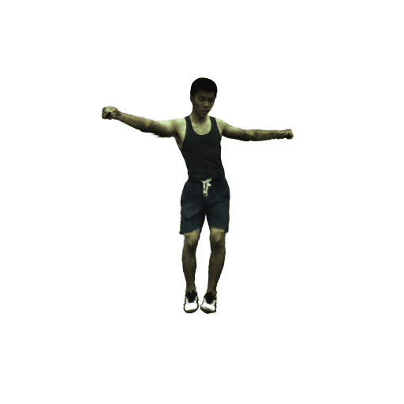
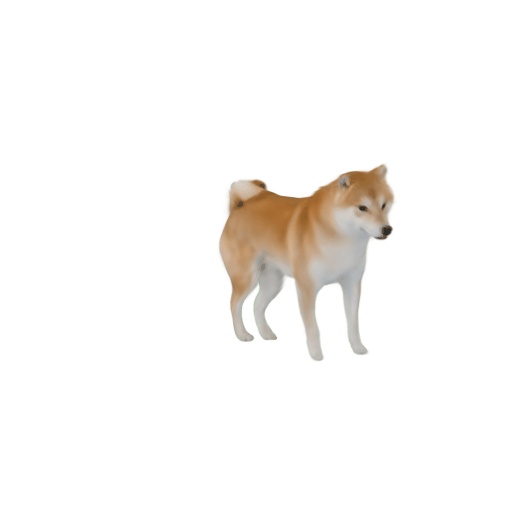
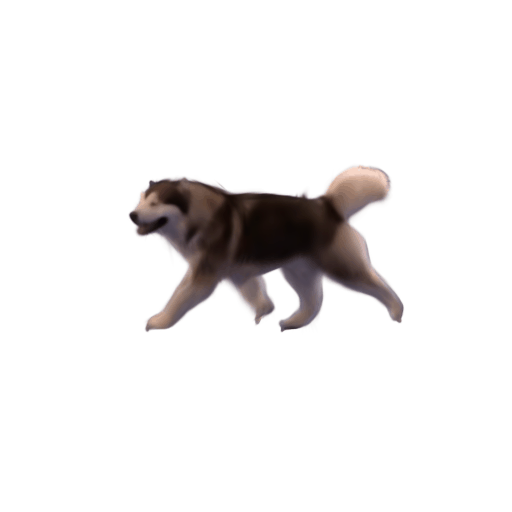
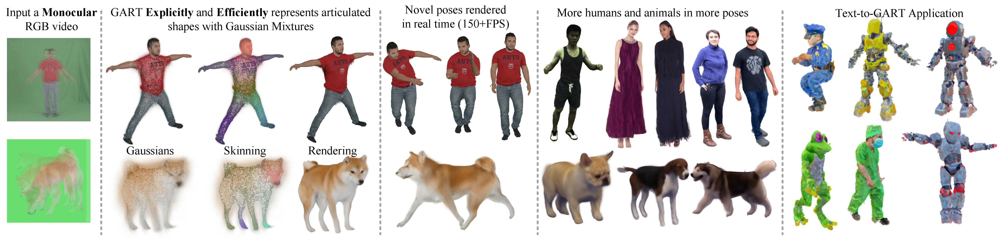
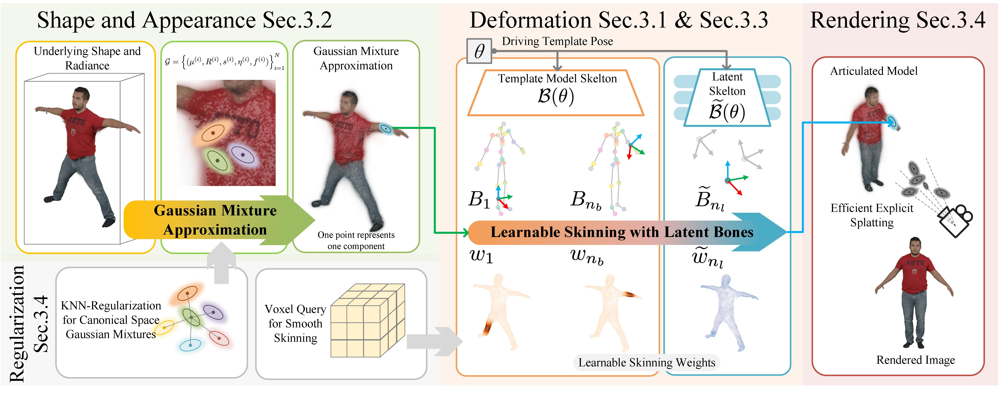

# GART: Gaussian Articulated Template Models

[Project Page](https://www.cis.upenn.edu/~leijh/projects/gart/); [Arxiv](https://arxiv.org/abs/2311.16099); [Youtube video](https://www.youtube.com/watch?v=-xYNtIlW4WY); [Bilibili video](https://www.bilibili.com/video/BV1Ru4y1F7Gp/)

- 2023.Nov.27: Code pre-release.

---

<p float="left">






</p>



<!--  -->

## Install

Our code is tested on Ubuntu 20.04 and cuda 11.8, you may have to change the following install script according to your system.
To install, run:

```shell
bash install.sh
```

## Prepare Data

### Template Models and Poses

<details>
<summary>SMPL for human body</summary>

Download SMPL v1.1 `SMPL_python_v.1.1.0.zip` from [SMPL official website](https://smpl.is.tue.mpg.de/download.php) and move and rename `SMPL_python_v.1.1.0/smpl/models/*.pkl` to `PROJECT_ROOT/data/smpl_model` So you can get:

```
PROJECT_ROOT/data/smpl_model
    ├── SMPL_FEMALE.pkl
    ├── SMPL_MALE.pkl
    ├── SMPL_NEUTRAL.pkl

# to check the version of SMPL, here is the checksum of female pkl we are using
cksum SMPL_FEMALE.pkl
3668678829 247530000 SMPL_FEMALE.pkl
```

</details>
<details>
<summary>AMASS (generation only)</summary>

Download the `SMPL-X N` package of `BMLrub` subset from [AMASS](https://amass.is.tue.mpg.de/index.html), unzip, and put it into `PROJECT_ROOT/data/amass/BMLrub`.

For generation application, you only have to download the SMPL models and AMASS poses. You can go to generation section directly and skip the following data downloading steps.

</details>

<details>
<summary>D-SMAL for dog body</summary>

If you want to work with dogs, please download `smal_data` from [BITE](https://owncloud.tuebingen.mpg.de/index.php/s/BpPWyzsmfycXdyj?path=%2Fdata) and put this folder to `lib_gart/smal/smal_data` so you get:

```
lib_gart/smal/smal_data
    ├── mean_dog_bone_lengths.txt
    ├── my_smpl_data_SMBLD_v3.pkl
    ├── my_smpl_SMBLD_nbj_v3.pkl
    ├── new_dog_models
    │   ├── 39dogsnorm_newv3_dog_dog_0.obj
    ...
    │   └── X_scaled_39dogsnorm_newv3_dog.npy
    └── symmetry_inds.json
```

</details>

### Real Videos

<details>
<summary>ZJU-MoCap</summary>

We use the data from [Instant-nvr](https://github.com/zju3dv/instant-nvr). Note the poses from [Instant-nvr](https://github.com/zju3dv/instant-nvr) is different from the original ZJU-MoCap, please follow the instructions in [Instant-nvr](https://github.com/zju3dv/instant-nvr) to download their data: download `ZJU-MoCap` and their smpl model `smpl-meta.tar.gz`. link the unzipped data so you have:

```shell
PROJECT_ROOT/data/
    ├── smpl-meta
    │   ...
    │   └── SMPL_NEUTRAL.pkl
    └── zju_mocap
        ├── my_377
        ├── ...
        └── my_394
```

</details>

<details>
<summary>PeopleSnapshot</summary>

We use the data from [InstantAvatar](https://github.com/tijiang13/InstantAvatar), including their pre-processed poses (already included when you clone this repo).
First download the data from [PeopleSnapshot](https://graphics.tu-bs.de/people-snapshot).
Then run `DATA_ROOT=PATH_TO_UNZIPPED_PEOPLESNAPSHOT bash utils/preprocess_people_snapshot.sh` to prepare the data.

</details>

<details>
<summary>Dog</summary>

Download our [preprocessed data](https://drive.google.com/file/d/1mPSnyLClyTwITPFrWDE70YOmJMXdnAZm/view?usp=drive_link) (pose estimated via [BITE](https://github.com/runa91/bite_release)):

```shell
cd PROJECT_ROOT/data
gdown 1mPSnyLClyTwITPFrWDE70YOmJMXdnAZm
unzip dog_data_official.zip
```

</details>

<details>
<summary>UBC-Fashion</summary>

Download our [preprocessed data](https://drive.google.com/file/d/18byTvRqOqRyWOQ3V7lFOSV4EOHlKcdHJ/view?usp=drive_link) (6 videos with pose estimated via [ReFit](https://yufu-wang.github.io/refit_humans/)):

```shell
cd PROJECT_ROOT/data
gdown 18byTvRqOqRyWOQ3V7lFOSV4EOHlKcdHJ
unzip ubc_release.zip
```

</details>

All the released [data](https://drive.google.com/drive/folders/1t9neHu-IAwWSLS0bo0m-tv8rqk11X5ru?usp=drive_link) and [logs](https://drive.google.com/drive/folders/1YubA0Xy35Tg7U1Eg11zJVa46IEljcNuc?usp=drive_link) can be downloaded from google drive.

## Fit Real Videos

We provide examples for the four dataset in `example.ipynb`.

And all fitting and testing scripts can be found under `script`.

For example, if you want to fit all people snapshot video, run:

```shell
bash script/fit_people_30s.sh
```

You may found other useful scripts under `script`.
The running time of each configuration is obtained from this [laptop](https://psref.lenovo.com/syspool/Sys/PDF/ThinkPad/ThinkPad_T15g_Gen_2/ThinkPad_T15g_Gen_2_Spec.pdf) with an RTX-3080 GPU with 16GB vRAM and an Intel i9-11950H processor with 4x16GB RAM. We observe that for some unkown reason the training is slower on our A40 cluster.

## Text2GART

Please see `text2gart.ipynb` for an example.

## Acknowledgement

Our code is based on several interesting and helpful projects:

- InstantAvatar: <https://github.com/tijiang13/InstantAvatar>
- InstantNVR: <https://github.com/zju3dv/instant-nvr>
- DreamGaussian: <https://github.com/dreamgaussian/dreamgaussian>
- MVDream-ThreeStudio: <https://github.com/bytedance/MVDream-threestudio>
- GaussianSplatting: <https://github.com/graphdeco-inria/gaussian-splatting>
- Diff-gaussian-rasterization: <https://github.com/JonathonLuiten/diff-gaussian-rasterization>
- ReFit: <https://github.com/yufu-wang/ReFit>
- BITE: <https://github.com/runa91/bite_release>

### TODO

- clean the code
- add bibtex
